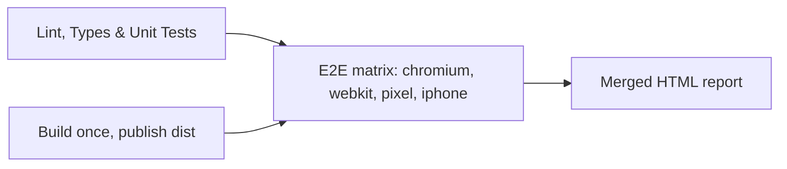

# React Playwright Demo

[](https://github.com/ramindusn/react-playwright-demo/actions/workflows/ci.yml)

A demo React application showcasing **Playwright E2E testing** with the Page Object Model and
fixtures, **Vitest** unit tests, an **axe** accessibility check, **TypeScript**, and a
**GitHub Actions** CI pipeline.

The framework is deliberately small. Every layer is something a new engineer can read in one
sitting, and every addition below earns its place by removing work as the suite grows.

## Tech Stack

- React 18 + TypeScript + Vite
- Vitest + Testing Library (component unit tests)
- Playwright (E2E across Chrome, Safari, Pixel 5, iPhone 13)
- axe-core (accessibility)
- ESLint + Prettier
- GitHub Actions (CI pipeline)

## Getting Started

```bash
nvm use          # Node version comes from .nvmrc
npm ci
npm run dev
```

## Scripts

| Script                   | What it does                                     |
| ------------------------ | ------------------------------------------------ |
| `npm run dev`            | Start the Vite dev server                        |
| `npm run build`          | Type check and build for production              |
| `npm run lint`           | ESLint over the app and the test code            |
| `npm run format`         | Format everything with Prettier                  |
| `npm run format:check`   | Verify formatting without writing (used by CI)   |
| `npm run typecheck`      | `tsc --noEmit` over `src`, `e2e` and the configs |
| `npm test`               | Vitest component unit tests                      |
| `npm run test:watch`     | Vitest in watch mode                             |
| `npm run test:e2e`       | Full Playwright suite, all four device projects  |
| `npm run test:e2e:smoke` | Only tests tagged `@smoke`                       |
| `npm run test:e2e:ui`    | Playwright interactive UI mode                   |

## Running the Tests

Unit tests need nothing but install:

```bash
npm test
```

E2E tests build the app, then Playwright starts the preview server itself:

```bash
npm run build
npx playwright install
npm run test:e2e
```

### Running against another environment

Set `BASE_URL` and the suite tests what is already deployed there instead of starting a local
server:

```bash
BASE_URL=https://staging.example.com npm run test:e2e
```

## Project Structure

```
src/
  components/           # React components (Counter, Greeting, TodoList)
  tests/                # Vitest component unit tests
e2e/
  pages/                # Page objects (BasePage + one per feature)
  fixtures.ts           # Custom fixtures that inject ready-to-use page objects
  *.spec.ts             # Playwright specs
playwright.config.ts    # Projects, reporters, baseURL, retries
eslint.config.js        # Shared rules, plus eslint-plugin-playwright for e2e/
.github/workflows/      # CI pipeline
```

## Adding a New Test

Four steps, in this order. The point is that a spec is the last thing you write and the only
thing a reviewer has to read.

**1. Give the element a `data-testid`** in the component:

```tsx
<button data-testid="clear-todos" onClick={clearAll}>
  Clear all
</button>
```

**2. Add the locator and the action to the page object** (`e2e/pages/TodoPage.ts`). Locators are
`readonly` fields set in the constructor. Actions are one method per thing a user does:

```ts
readonly clearBtn: Locator;
// in the constructor
this.clearBtn = page.getByTestId('clear-todos');

async clearTodos() {
  await this.clearBtn.click();
}
```

**3. Expose it as a fixture** if the page object is new. Add it to the `Pages` type and the
`test.extend` block in `e2e/fixtures.ts`, and it arrives in every spec already navigated.

**4. Write the spec** so it reads as a user story:

```ts
test('clears every todo', async ({ todoPage }) => {
  await todoPage.addTodo('Task 1');
  await todoPage.addTodo('Task 2');
  await todoPage.clearTodos();
  await expect(todoPage.emptyState).toBeVisible();
});
```

## Conventions

- **Specs never touch `page` or a CSS selector.** If a spec needs a new locator, it belongs on a
  page object. The only exception is the accessibility spec, which scans the whole document.
- **One page object per feature**, extending `BasePage` and declaring the route it owns.
- **`data-testid` first**, `getByRole` where it reads naturally. If an element lacks a testid, add
  one rather than reaching for a fragile selector.
- **Tag one test per feature `@smoke`** so the fast gate stays fast.
- **Conventional Commits**, one logical change per commit.

## Architecture & Decisions

I think of a test framework as **three layers**, with CI/CD wrapping around them:

1. **Test layer** — the specs and assertions. They read like a user story and stay free of
   selector and setup noise.
2. **Logic layer** — page objects and fixtures. All interaction detail lives here.
3. **Config & reporting layer** — Playwright config, reporters, traces and videos, and the CI
   pipeline.

Key decisions:

- **Page Object Model + `BasePage`.** Each feature has a page object that owns its locators and
  actions, and declares its own route. When the UI changes, I update one place, not every test.
- **Custom fixtures for dependency injection.** Specs receive a ready-to-use page object
  (`async ({ todoPage }) => ...`) instead of constructing one. Less boilerplate, and adding
  setup later is a one-line change in the fixture rather than an edit to every test.
- **`data-testid` locators.** Selectors stay stable when styling or copy changes.
- **The test code is linted and type checked like production code.** `e2e/` is inside the
  TypeScript project, and `eslint-plugin-playwright` guards the mistakes that matter most, above
  all a missing `await` on an expect, which turns a real failure into a silent pass. It caught
  three imprecise assertions the day it was added.
- **`@smoke` tags instead of a second suite.** A pull request can run the fast path and a nightly
  run can run everything, from one suite with no duplicated code.
- **`BASE_URL` selects the environment.** The same tests verify a local build or a deployed one,
  which is what makes them useful in a release pipeline rather than only on a laptop.
- **Accessibility is a test, not a review step.** axe runs in CI on every push, and it found two
  real landmark defects on its first run.
- **Multi-viewport coverage.** Desktop Chrome, Desktop Safari, Pixel 5 and iPhone 13, so mobile
  runs on a real mobile engine rather than a resized desktop window.
- **Testing pyramid.** Vitest covers component logic, Playwright covers user flows. Each tool is
  used where it gives the most value.

## Playwright Configuration

Tests run on four browser and device projects:

| Project  | Device         |
| -------- | -------------- |
| chromium | Desktop Chrome |
| webkit   | Desktop Safari |
| pixel    | Pixel 5        |
| iphone   | iPhone 13      |

On failure, Playwright keeps a trace, a video and a screenshot. Locally the reporters are `list`
plus an HTML report that opens only when something fails. On CI they are `list`, `blob` (merged
into one report at the end) and `github` (failures annotated inline on the pull request).

## CI Pipeline

Runs on every push and pull request to `main`. Superseded runs on the same branch are cancelled.



1. **quality** — lint, formatting, types and unit tests. Fails fast and cheaply.
2. **build** — compiles once and uploads `dist`, so no E2E job rebuilds the app.
3. **e2e** — fans out over the four projects. Each job installs only the browser engine it needs
   and reads it from a cache keyed on the lockfile. Blob reports upload always, traces and video
   upload on failure.
4. **report** — merges the four blob reports into a single HTML report for the whole run, kept for
   30 days.

Dependabot proposes weekly npm and GitHub Actions updates, grouped into one pull request each.
